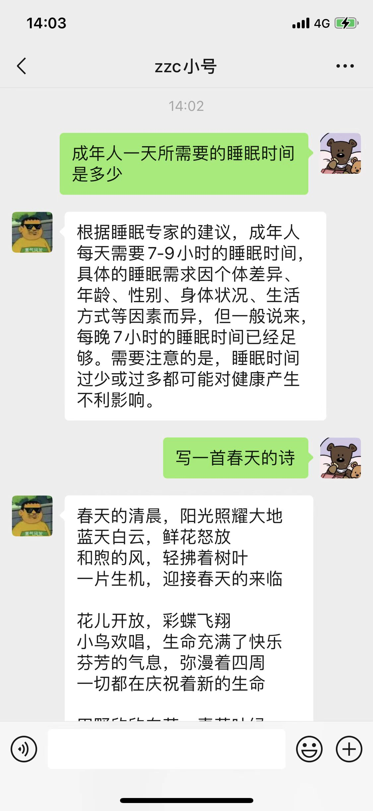

## 基于 openai chatgpt gpt-3.5-turbo wechaty 的微信智能聊天机器人

### 接入前准备工作
- 一个微信小号
- 在 [openai](https://platform.openai.com/account/api-keys) 获取一个api-keys 有免费额度

### 接入微信
1. 启动项目
2. 打开手机扫二维码即可开始接入ChatGPT
3. 对话内容将会被保存在data-[名字].json中，在微信回复“清除”可以清除聊天内容。

